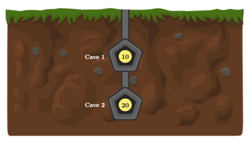
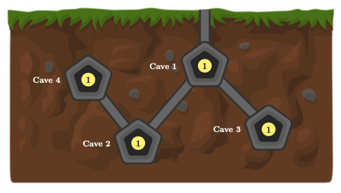
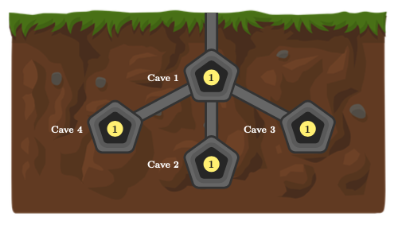

# Problem C1: Gold Mine - Chapter 1

[https://www.facebook.com/codingcompetitions/hacker-cup/2021/qualification-round/problems/C1](https://www.facebook.com/codingcompetitions/hacker-cup/2021/qualification-round/problems/C1)

## Results

:white_check_mark: &nbsp; Sample Test Cases

:white_check_mark: &nbsp; Validation Test Cases

:white_check_mark: &nbsp; Final Test Cases

## Problem

**Note: This problem shares similarities with [Chapter 2](../Problem%20C2:%20Gold%20Mine%20-%20Chapter%202). The solution to either chapter may help with solving the other, so please consider reading both first.**

Just like [logging](https://www.youtube.com/watch?v=7AheBqBk0iQ), mining is a key industry in Canada's primary sector. Prospectors use geological tools to find ore deposits, then [drill, and blast](https://www.youtube.com/watch?v=zPbY--IXGg8&t=463s) to excavate a system of underground tunnels for access to the ores.

Minerva is a contract miner who spends her days extracting gold ore from underground mines across Ontario. One particular gold mine she's contracting for consists of `N` underground caves, numbered from `1` to `N`, with cave `1` having an exit to the surface. There are also `N − 1` tunnels running among the caves, the `i`th of which allows one to travel in either direction between caves <code>Ai</code> and <code>Bi</code>. Each cave is reachable from cave `1` by a sequence of these tunnels.

Cave `i` is known to contain <code>Ci</code> ounces of gold ore. With her trusty dump truck, Minerva plans to drive underground starting in cave `1`, collect as much gold ore as possible, and exit back to the surface through cave `1`.

There's just one issue: the tunnels are highly unstable, and will cave in after Minerva drives through them. Therefore, she is only able to traverse each tunnel at most once. Fortunately, the caves themselves are reinforced with pillars and will never collapse — she may visit each cave any number of times (though she can only collect its gold ore at most once).

This safety measure may limit mobility. Thankfully, Minerva's truck is also equipped to be a drill rig. As she travels through the system of caves, she may at any point use it to travel from her current cave to any other cave by drilling a new tunnel. **In this chapter, the rig only has the energy to drill at most one such tunnel.** Unfortunately, this new tunnel will be just as unstable as the existing ones — Minerva will only dare travel through it once.

Please help Minerva determine the maximum weight of gold ore that can be collected if she begins in cave `1`, spends any amount of time exploring the mine (traveling through tunnels, drilling at most one new tunnel, and collecting ore from any visited caves), and end up once again in cave `1`.

## Constraints

- 1 ≤ T ≤ 35

- 1 ≤ N ≤ 50

- 0 ≤ Ci ≤ 20,000,000

- 1 ≤ Ai, Bi ≤ N

The sum of `N` across all test cases is at most `1,000`.

## Input

Input begins with an integer `T`, the number of mines that Minerva is contracted to work. For each mine, there is first a line containing the single integer `N`. Then, there is a second line containing `N` space-separated integers, <code>Ci,1..N</code>. Then, `N - 1` lines follow, the `i`th of which contains the space-separated integers <code>Ai</code> and <code>Bi</code>.

## Output

For the `i`th mine, output a line containing _"Case #i: "_ followed by a single integer, the maximum weight of gold ore (in ounces) that Minerva can collect before leaving the mine.

## Sample Explanation

The first mine looks as follows:

It's possible to visit both caves (collecting `30` ounces of ore) and then return to cave `1`, for example by taking the tunnel from cave `1` to cave `2` and then drilling a tunnel back to cave `1`.

The second mine looks as follows:

It's possible to end up with the ore from all `4` caves, for example by taking the tunnel to cave `3`, drilling to cave `4`, and then taking tunnels to cave `2` followed by cave `1`.

The third mine looks as follows:

It's possible to end up with `3` ounces of ore, but Minerva cannot collect all `4` ounces while still returning to cave `1` and only drilling one tunnel.

| Sample Input                                                                                                                                                                                                                                | Sample Output                                                         |
| ------------------------------------------------------------------------------------------------------------------------------------------------------------------------------------------------------------------------------------------- | --------------------------------------------------------------------- |
| 5 2 10 20 1 2 4 1 1 1 1 2 1 4 2 1 3 4 1 1 1 1 2 1 4 1 1 3 6 5 4 1 3 2 4 5 1 5 4 5 3 5 2 6 3 9 2 14 7 6 11 3 6 1 8 4 5 6 7 8 9 1 3 6 8 2 4 4 1 1 8 | Case #1: 30 Case #2: 4 Case #3: 3 Case #4: 12 Case #5: 32 |
